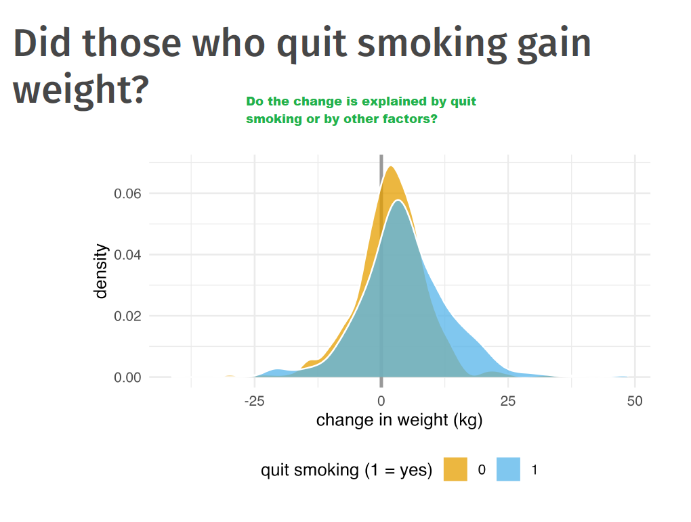
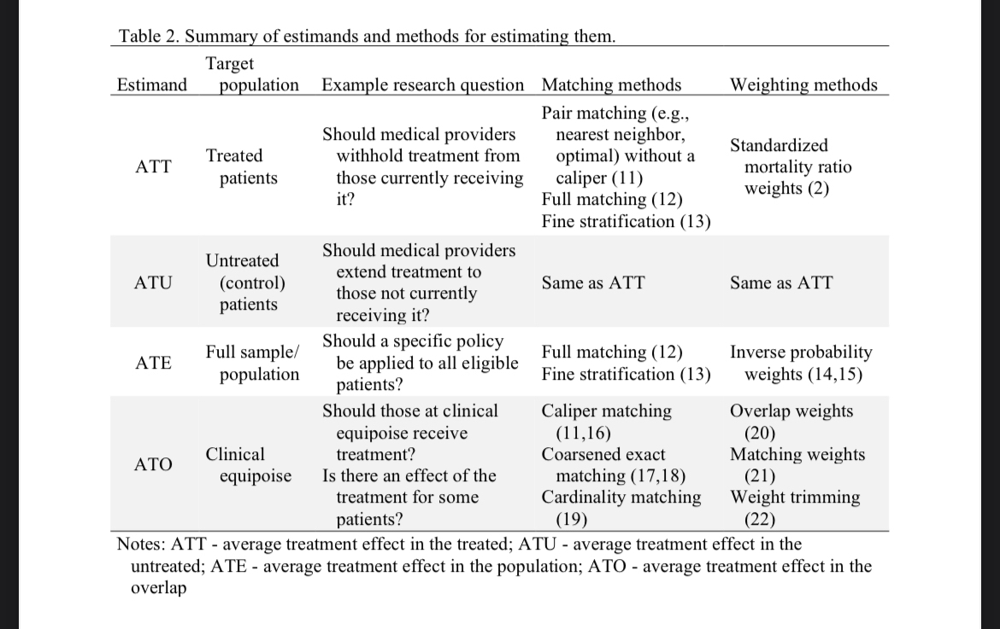

```{r setup, include=FALSE}
knitr::opts_chunk$set(echo = TRUE)
```


```{r}
# Libraries:

install.packages("causaldata")
install.packages("estimatr")
install.packages("rsample")
install.packages("tidysmd")
install.packages("splines")
library(causaldata)
library(estimatr)
library(rsample)
library(tidysmd)
library(splines)

remotes::install_github("malcolmbarrett/causalworkshop")

```


Asociación entre variables. Buscamos una relación **causal**. 

*Conterfactual world:* Imagine world. 

*Factual world:* reality

Do it at individual level is too difficult. Instead we are lloking to whtat happen if everyone or no one is exposed to the treatment.

**No confounding:** Just look for the cause we are interested. 

# Muy importante:

1. No empezar con el análisis de los datos, si no planteando la **causal question**. Separate people, units in very defined groups of treatment. 

2. DAGs: "this is the relationshio between our variables"

3. Modelling

4. Diagnisticos

5. Estimations

6. How good our variables explain the phenomena

# Variables, variables, variables




The descriptive analysis does not gives us enough information about our question. 

# For what do I have to control

**Not everything in the causal driagram.** 

¿Confounder? 


# Calculate the **exposure** with a logistic regression

> counterfactual: what if everyone quit smoking vs. what if no one quit smoking

Predicting the probability of quit smoking. We are trying to predict the treatment. 


**SMD**: Standard Mean Difference. There are difference between the groups across variables, when we do not weight them. 


> In the slide 23 we are weighting the variables according with the propensity score. 

Not doing it will deal to confidence intervals too narrow, p-values to small. 

> **IPW:** inverse probability weighted

* Robust lse: adds more uncertainty **the best**

We must not keep some confounding in our model. 

**DAG:** Directed aciclyc graph

Feedback loops: appear in time measures when after the treatment the effect does correspond to the treamtment before 

# Propensity score is ...
 THe propensity of treatment (towards having the treatment)
 
> **Porbability of exposure given the confounders**

We cannot seen conterfactual but we can predict those conterfactuals. 

# DAGS:

Always look for someone to help you to construct the DAG, it is a challenge for one, you need different overviews. 

# Backdoor paths

other paths that connect the exposure and the outcome.

> There are no analysis that help you to chose the confounders

# ¿How to know if I have to work with causal questions?

# Estimands table




> **Ommited variable bias** are confounders that are critical and no added to our model

# Love plots and balancing

We want to know the effect of extra magic morning on waiting times. When we use the confounders we do not want to that to explain the difference, between wether or not there was an extra magic morning. By weighting the confounders we get rid of the effect of the, let's say the weather variable, and just let the part of the causal explanation we are looking for: "waiting times are caused by extra magic morning"

If there is a very huge inbalance, you must check your DAG, include all pre treatment variables to see how it performs in balance terms. We are balancing on propensity scores. We are looking at the balance on the exposure **not in the outcome**

Means that there is balance on the exposure that does not mean it should be included in our DAG.

We do not include post treatment variables. Everything pre treatment causes the exposure, it has to happen before. Post treatment variables is something the treatment causes. Too moch variables and to few observations mean that you will can't balance, and you will be adding a lot of bias

# ECDF

What will happen with the tails of the distribution will depend de estimand we choose.

```{r, eval=FALSE}
?ns
```

Overlap wheigth will balance perfectingly to the mean. 

# Para debuggear una sola vez

```{r, eval=FALSE}

debugone()
```


