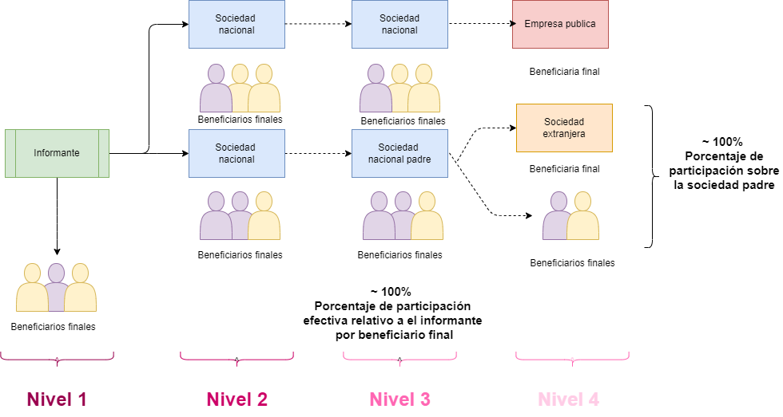

```{r setup, include=FALSE}
options(htmltools.dir.version = FALSE)


knitr::opts_chunk$set(
  fig.width=9, 
   fig.height= 5, 
  fig.retina=3,
  out.width = "100%",
  cache = FALSE,
  echo = FALSE,
  message = FALSE, 
  warning = FALSE,
  hiline = TRUE
)

library(xaringanthemer)

style_mono_light(base_color = "#005CBE")

```


```{r, eval = FALSE}


page <- read_html("https://www.jezl-auditores.com/index.php/tributario/112-anexo-de-accionistas-participes-socios-aps")

page %>% 
  html_node("body") %>% 
  html_text() %>% 
  HTML()

```


```{r}

library(rvest)
library(htmltools)
library(tidyverse)
library(gt)
library(scales)
library(readxl)
library(fuzzyjoin)
library(patchwork)

informantes <- read_tsv("../../../../data/merges/resumen_aps_ruc.txt")

tabla_informantes <- informantes %>% 
  select(-RUC) %>% 
  pivot_longer(cols = c(APS,merge),
               names_to = "var",values_to = "val") %>% 
  mutate(year = str_remove(year,"_") %>% as.numeric,
         var = case_when(var == "APS" ~ "Número de informantes",
                         TRUE ~ "Informantes en el RUC")) 


tabla_informantes %>% 
  ggplot() +
  geom_line(aes(x = year,y = val,color = var),size = 1) +
  geom_vline(aes(xintercept = 2012),color = "lightblue",size = 1)+
  geom_vline(aes(xintercept = 2015),color = "lightblue",size = 1)+
  geom_vline(aes(xintercept = 2016),color = "lightblue",size = 1)+
  geom_vline(aes(xintercept = 2017),color = "lightblue",size = 1) +
  theme_minimal() +
  theme(plot.background = element_rect(fill = "#E5EEF8",
                                       color = "#E5EEF8") ,
        panel.grid.major = element_line(colour = "lightgray"),
        panel.grid.minor = element_line(colour = "lightgray")) +
  labs(x = "",
       title = "Informantes (sociedades) del APS en el RUC",
       subtitle = "Conteo de sociedades en el tiempo",
       legend = "Fuente",
       caption = "Fecha de corte del RUC es mayo de 2021. Fecha de corte del APS es junio de 2022.")

```

---

class: middle

# Indice:

* Revisión de las preguntas de investigación
* Sanciones *pre - reforma* y *post - reforma* 2015
* Más detalles sobre la estructura del Anexo APS
* Indicadores clave para nuestras preguntas de investigaciones (de estos indicadores se derivan otras variables a nivel de empresa que nos permitiran hacer un diseño de estudio)
* Revisión de estadísticas (El estado de las cifras presentadas esta en proceso de corrección)

---


## Preguntas causales

.center[

¿Las empresas que **no presentan (o presentan de manera incompleta) el anexo APS transparentaron en mayor medida** su información societaria tras **afrontar las sanciones propuestas en la reforma del 2015**?


¿**La empresas redujeron su participación societaria con residencia en paraísos fiscales** tras afrontar las **sanciones propuestas en la reforma del 2015**?

]


> En la reforma del 2015 se pone en vigencia la sanción del 3% la tarifa del impuesto a la renta a las empresas que no presenten el anexo APS o en su defecto tengan más del 50% de su participación societaria en paraísos fiscales.


---
 
 # Sanciones por la falta de declaración del Anexo
 
 ## LEY DE REGIMEN TRIBUTARIO INTERNO, CODIFICACION
 
 ### Hasta 2015
 
---

# Sanciones pre reforma

**Art. 107.**- Valor de la declaración.- Para el cobro de los impuestos establecidos en esta Ley y demás créditos tributarios relacionados, determinados en declaraciones o liquidaciones por los propios sujetos pasivos, tal declaración o liquidación será documento suficiente para el inicio de la respectiva acción coactiva, de conformidad con lo previsto en el Código Tributario. 
 
**Art. 107 D.**- Inconsistencias en la declaración y anexos de información.- Si el Servicio de Rentas Internas detectare inconsistencias en las declaraciones o en los anexos que presente el contribuyente, siempre que no generen diferencias a favor de la Administración Tributaria, notificará al sujeto pasivo con la inconsistencia detectada, otorgándole el plazo de 10 días para que presente la respectiva declaración o anexo de información sustitutivo, corrigiendo los errores detectados. La falta de cumplimiento de lo comunicado por la Administración Tributaria constituirá contravención, que será sancionada de conformidad con la ley. La imposición de la sanción no exime al sujeto pasivo del cumplimiento de su obligación, pudiendo la Administración Tributaria notificar nuevamente la inconsistencia y sancionar el incumplimiento. La reincidencia se sancionará de conformidad con lo previsto por el Código Tributario. 
 

> Evolución de la base legal: Resolución NAC-DGERCGC16-00000536 RO 919 del 10-01-2017, que deroga a las Resoluciones NAC-DGERCGC16-00000082 y  No. NAC-DGERCGC15-00003236, la que a su vez derogó la Resolución NAC-DGERCGC12-0077
---

```{r}

# Tablas de multas antes de 2016

cuantias_no_notificado <- tribble(~`Tipo de contribuyente`, ~`Cuantías en USD`,
 "Contribuyente especial" , "USD. 250,00",
"Sociedades con fines de lucro", "USD.125,00",
 "Persona natural obligada  a llevar contabilidad", "USD. 62,50",
"Persona natural no obligada a llevar contabilidad, sociedades sin fines de lucro", "USD. 31,25")


cuantias_notificado <- tribble(~`Tipo de contribuyente`, ~`Cuantías en USD`,
 "Contribuyente especial" , "USD. 375,00",
"Sociedades con fines de lucro", "USD.187,50",
 "Persona natural obligada  a llevar contabilidad", "USD. 93,75",
"Persona natural no obligada a llevar contabilidad, sociedades sin fines de lucro", "USD. 46,88")


omisiones <- tribble(~`Tipo de contribuyente`, ~`Cuantías en USD`,
 "Contribuyente especial" , "USD. 500,00",
"Sociedades con fines de lucro", "USD.250,00",
 "Persona natural obligada  a llevar contabilidad", "USD. 125,00",
"Persona natural no obligada a llevar contabilidad, sociedades sin fines de lucro", "USD. 62,50")

# Función auxiliar:

gt_format <- function(tabla){
  
  tabla %>% 
    mutate(across(.cols = `Tipo de contribuyente`,.fns = factor,levels = c("Contribuyente especial" ,"Sociedades con fines de lucro",
                                                                           "Persona natural obligada  a llevar contabilidad",
                                                                           "Persona natural no obligada a llevar contabilidad, sociedades sin fines de lucro"))) %>% 
    gt() %>% 
    data_color(
      columns = `Tipo de contribuyente`,
      colors = scales::col_factor(
        levels = c("Contribuyente especial" ,"Sociedades con fines de lucro",
                   "Persona natural obligada  a llevar contabilidad",
                   "Persona natural no obligada a llevar contabilidad, sociedades sin fines de lucro"),
        palette = c("#E5EEF8", "#45ACD5" , "#E5EEF8","#E5EEF8"),
        domain = c("Contribuyente especial" ,"Sociedades con fines de lucro",
                   "Persona natural obligada  a llevar contabilidad",
                   "Persona natural no obligada a llevar contabilidad, sociedades sin fines de lucro")
      ),
      apply_to = "fill",
      autocolor_text = TRUE
    )


}

```

.pull-left[


```{r}

gt_format (cuantias_no_notificado) %>% # 
  tab_header(
    title = "Cuantías de multas liquidables por omisiones no notificadas por la administración tributaria.", 
    subtitle = "Los sujetos pasivos que no hubieren recibido aviso de la administración tributaria, respecto de la no presentación de declaraciones o anexos" 
  ) %>% 
  tab_options(
    table.background.color = "#FFFFFF00",
    heading.background.color = "#005CBE",
    column_labels.background.color = "#005CBE",
    column_labels.font.size = px(10),
    column_labels.font.weight = "bold",
     table.font.color = "black",
     table.font.size = px(12L),
    table.width = px(500)
)

```


]


.pull-right[


```{r}

gt_format (cuantias_notificado) %>% # 
  tab_header(
    title = "Cuantías de multas liquidables por omisiones no notificadas por la administración tributaria.", 
    subtitle = "Los sujetos pasivos que no hubieren recibido aviso de la administración tributaria, respecto de la no presentación de declaraciones o anexos" 
  ) %>% 
  tab_options(
    table.background.color = "#FFFFFF00",
    heading.background.color = "#005CBE",
    column_labels.background.color = "#005CBE",
    column_labels.font.size = px(10),
    column_labels.font.weight = "bold",
    table.font.color = "black",
    table.font.size = px(12L),
    table.width = px(500)
)

```


]

<br>

.center[


```{r}


gt_format (omisiones) %>% # 
  tab_header(
    title = "Cuantías de multas liquidables por omisiones no notificadas por la administración tributaria.", 
    subtitle = "Los sujetos pasivos que no hubieren recibido aviso de la administración tributaria, respecto de la no presentación de declaraciones o anexos" 
  ) %>% 
  tab_options(
    table.background.color = "#FFFFFF00",
    heading.background.color = "#005CBE",
    column_labels.background.color = "#005CBE",
    column_labels.font.size = px(10),
    column_labels.font.weight = "bold",
    table.font.color = "black",
    table.font.size = px(12L),
    table.width = px(500)
)

```


]

---

# Sanciones por la falta de declaración del Anexo
 
## Posterior a la "LEY ORGÁNICA DE REGIMEN TRIBUTARIO INTERNO"
 
### A partir de 2016

---

## Con respecto a la transparencia de la información societaria

-   La reforma del 2015 nos indica qué si la participación total de la empresa en paraísos fiscales supera el 50% la empresa deberá pagar 3% adicional de impuesto a la renta sobre la totalidad de la base imponible

# Con respecto al uso de paraisos fiscales

-   La misma sanción aplica para la no presentación del APS

> Si la empresa declara participación efectiva en paraísos fiscales menor al 50% o presenta el APS incompleto, la sanción se aplicará sobre el proporcional de la base imponible considerando en el primer caso la participación en paraísos fiscales y en el segundo el porcentaje no reportado en el APS
---

class: inverse,middle

# Anotaciones sobre la estructura del APS

## (Fuente primaria de consulta: Data Map)

---


### Identificaciones:

-   **Año Fiscal.** (Año declarado, se toma la información presentada en el periodo, no las modificaciones realizadas en periodos posteriores)

-   **Identificación de la sociedad informante anonimizada.** Corresponde a la sociedad que informa el Anexo APS y por ende su división accionaria

-   **Nivel de participación societaria.** Indica el nivel de propiedad de acciones de la sociedad informante. Por ejemplo, una sociedad que declara un socio de tercer nivel de participación, quiere decir que la propiedad de la participación pasa por 2 sociedades antes de volverse efectiva

-   **Identificación de sociedad accionista anonimizada.**Depende del nivel de participación, considerando que uno de los propósitos del anexo APS es identificar al beneficiario final. Por construcción de las bases de datos *el nivel de participación 1 será la misma sociedad informante*. El resto de niveles son participación indirecta (sociedades accionistas).

---

### Identificaciones, el caso del beneficiario final:

-   **Identificación anonimizada de los accionistas.** Se continua en la cadena de propiedad de acciones hasta llegar el beneficiario final que puede ser una de las siguientes categorías:

  - Personas naturales con residencia fiscal en Ecuador
  - Personas naturales o sociedades con residencia fiscal en el extranjero
  - El estado ecuatoriano, empresas públicas, organismos internacionales. dependencias y organismos de estados extranjeros.

### Porcentajes de participación:

-   **Porcentaje de participación.** Indica el porcentaje de participación en la sociedad accionista declarada por la sociedad informante en un determinado nivel. El 100% se alcanza como todos los socios de la sociedad accionista en un determinado nivel.

-   **Porcentaje efectivo.** Porcentaje de participación que tiene el beneficiario final (los tipos señalados en el punto anterior) de el total de la participación de la sociedad informante.
---


.center[


```{r, echo=FALSE, out.width="75%", fig.cap="Figura 1. Diagrama ejemplo de relaciones societarias registradas en el Anexo APS"}

```


]

>  En el gráfico el color más intenso en el texto del nivel indica relaciones más directas de propiedad, mientras que el color palido indica propiedad cada vez más indirecta, en el sentido de que **para determinar la paritcipación efectiva de un beneficiario final es necesario pasar por la participación de las sociedades padres en un nivel determinado** 


---

```{r}

raw_data <- read_excel("ejemplo_aps.xlsx")


raw_data %>% 
  rename_with(.fn = ~ str_replace(.x,"_"," ") %>% 
                str_to_sentence() %>% 
                str_replace("aps","accionario")) %>% 
  mutate(across(Porcentaje,percent),
         parent = `Accionista` %in% c("R1","R2","R3","R9","R13"),
         parent = factor(parent)) %>% 
  gt() %>% 
  gt::cols_hide(columns = "parent") %>% 
  tab_options(
    data_row.padding = px(1) 
  ) %>% 
  data_color(
    columns = `Nivel accionario`,
    colors = scales::col_numeric(
      palette = c("#3F96F5", "#6498D1", "#8BA3BD"),
      domain = c(1, 3)
    )
  ) %>% 
  tab_style(
     style = cell_fill(color = "#B496CB"),
     location = cells_body(
       columns = Accionista,
       rows = parent == "TRUE"
     )
   ) %>% 
  tab_header(
    title = md("**Tabla 1. Ejemplo simulado a partir de los datos originales del APS**")
  ) %>% 
  cols_label(Informante = md("**Informante**"),
             Sociedad = md("**Nivel accionario**"),
             `Nivel accionario` = md("**Nivel accionario**") ,
             Accionista = md("**Accionista**"),
             Porcentaje = md("**Porcentaje**")) %>% 
  tab_footnote(footnote = "El color indica el nivel de participación, entre más intenso el color más directa es la propíedad de la participación",
               locations = cells_column_labels(columns = `Nivel accionario`)) %>% 
  tab_footnote(footnote = "El color purpura indica las sociedades padre de la propuedad indirecta",
               locations = cells_column_labels(columns = Accionista))


```

---
class: middle


# Indices de clave:


## Respecto a la transparencia de la información societaria:

* *Indice de cumplimiento entre los declarantes del anexo:* 
  - **Descripción:** Tasa anual resultado de la división de la frecuencia de empresas cuya suma de todas las participaciones de los beneficiarios finales sea menor a 100% y el número total de empresas informantes
  - **Fuente:** APS 
  
* *Indice de cumplimiento entre los obligados a declarar el anexo:* 
  - **Descripción:** Tasa anual resultado de la división de la frecuencia de empresas cuya suma de todas las participaciones de los beneficiarios finales sea menor a 100% y el número total de sociedades obligadas a llenar el anexo.
  - **Fuente:** APS, F101

---
class: middle

# Indices de clave:


## Respecto al uso de paraisos fiscales:

* *Indice de uso de paraisos fiscales:* 
  - **Descripción:** Tasa anual resultado de la división de la frecuencia de empresas cuya suma de todas las participaciones de los beneficiarios finales con residencia en paraisos fiscales sea superior al 50% y el número total de empresas informantes
  - **Fuente:** APS 
  
* *Indice de cumplimiento entre los obligados a declarar el anexo:* 
  - **Descripción:** Tasa anual resultado de la división de la frecuencia de empresas cuya suma de todas las participaciones de los beneficiarios finales con residencia en paraisos fiscales sea superior al 50% y el número total de sociedades obligadas a llenar el anexo.
  - **Fuente:** APS, F101


---

class: middle
# Estadísticas agregadas de la participación en paraisos fiscales y el estado de transparencia de la información societaria en el anexo APS

## <p style="color:red">Los datos presentados en esta sección están en estado de corrección debido al *cálculo y validación de los valores de porcentaje efectivo*</p>


---
 
```{r}
compl <- read_tsv("../../data/tablas_planas/agregados/completos_part_pff.txt") %>% 
  pivot_longer(cols = -1,names_to = "year",values_to = "completos")

incompl <- read_tsv("../../data/tablas_planas/agregados/incompletos_part_pff.txt") %>% 
  pivot_longer(cols = -1,names_to = "year",values_to = "incompletos")

mas50 <- read_tsv("../../data/tablas_planas/agregados/mayor_50_pff.txt") %>% 
  pivot_longer(cols = -1,names_to = "year",values_to = "mayor50")

plot_bar <- function(tabla,var,cincuenta = FALSE){
  

  
  if(cincuenta == TRUE){
    
    tabla <-  tabla %>% 
      filter(partic_en_pff_factor != "(100,Inf]",
             !is.na(partic_en_pff_factor)) %>% 
      mutate(partic_en_pff_factor = as.character(partic_en_pff_factor),
             tramo = case_when(partic_en_pff_factor == "(40,50]" ~ "Igual a 50%",
                               partic_en_pff_factor == "(90,100]" ~ "Mayor al 90%",
                               TRUE ~ "Entre 50% y 90%"),
             tramo = factor(tramo,levels = c("Igual a 50%",
                                             "Entre 50% y 90%",
                                             "Mayor al 90%")))
    
  
  totales <- tabla %>% 
    group_by(year,tramo) %>% 
    summarise(across(.cols = all_of(var),
                     .fns = sum,na.rm = TRUE)) %>% 
    mutate(pos = "tramo",
           across(.cols = all_of(var),
                  .fns = list(label = ~number(.x,big.mark = " ")),
                  .names = "{.fn}"))
    
  intermedios <- tabla %>% 
    filter(!partic_en_pff_factor %in% c("[0,10]","(90,100]"),
             !is.na(partic_en_pff_factor)) %>% 
    mutate(partic_en_pff_factor = factor(partic_en_pff_factor,
                                         levels = c("(40,50]","(50,60]",
                                                    "(60,70]","(70,80]","(80,90]"),
                                         labels = c("(40%, 50%]","(50%, 60%]",
                                                    "(60%, 70%]","(70%, 80%]","(80%, 90%]")),
           across(.cols = all_of(var),
                  .fns = list(label = ~number(as.integer(.x),big.mark = " ",accuracy = 1)),
                  .names = "{.fn}"),
           across(.cols = label,
                  .fns = ~if_else(as.integer(str_remove(.x," ")) < 4,NA_character_,label),
                  .names = "{.col}"))
    
  }else{
    
      tabla <-  tabla %>% 
    filter(partic_en_pff_factor != "(100,Inf]") %>% 
    mutate(partic_en_pff_factor = as.character(partic_en_pff_factor),
           tramo = case_when(partic_en_pff_factor == "[0,10]" ~ "Menor al 10%",
                             partic_en_pff_factor == "(90,100]" ~ "Mayor al 90%",
                             TRUE ~ "Entre 10% y 90%"),
           tramo = factor(tramo,levels = c("Menor al 10%",
                                           "Entre 10% y 90%",
                                           "Mayor al 90%")))
  
  
  totales <- tabla %>% 
    group_by(year,tramo) %>% 
    summarise(across(.cols = all_of(var),
                     .fns = sum,na.rm = TRUE)) %>% 
    mutate(pos = "tramo",
           across(.cols = all_of(var),
                  .fns = list(label = ~number(.x,big.mark = " ")),
                  .names = "{.fn}"))
    
  intermedios <- tabla %>% 
    filter(!partic_en_pff_factor %in% c("[0,10]","(90,100]")) %>% 
    mutate(partic_en_pff_factor = factor(partic_en_pff_factor,
                                         levels = c("(10,20]","(20,30]",
                                                    "(30,40]","(40,50]","(50,60]",
                                                    "(60,70]","(70,80]","(80,90]"),
                                         labels = c("(10%, 20%]","(20%, 30%]",
                                                    "(30%, 40%]","(40%, 50%]","(50%, 60%]",
                                                    "(60%, 70%]","(70%, 80%]","(80%, 90%]")),
           across(.cols = all_of(var),
                  .fns = list(label = ~number(as.integer(.x),big.mark = " ",accuracy = 1)),
                  .names = "{.fn}"),
           across(.cols = label,
                  .fns = ~if_else(as.integer(str_remove(.x," ")) < 4,NA_character_,label),
                  .names = "{.col}"))  
  }
  
  
  plot_1 <-  ggplot(data = intermedios,
                    aes_string(x = "partic_en_pff_factor",y = var)) +
    geom_col() +
    geom_text(aes_string(label = "label"),vjust = 1.5,color = "white",size = 2.5) +
    geom_vline(mapping = aes(xintercept = 4.5),
               hjust = 1.5,color = "blue",size = 1) +
    facet_wrap(.~year,nrow = 3,ncol = 3) +
    theme_minimal() +
    theme(axis.text.x = element_text(angle = 90,size = 6),
          axis.text.y = element_text(size = 6),
          panel.spacing.x = unit(1, "lines"),
          panel.spacing.y = unit(1, "lines"),
          plot.background = element_rect(fill = "#E5EEF8",
                                         color = "#E5EEF8") ,
          panel.grid.major = element_line(colour = "lightgray"),
          panel.grid.minor = element_line(colour = "lightgray")) 
  
  plot_2 <- ggplot(data = totales,
                   aes_string(x = "pos",y = var,fill = "tramo")) +
    geom_col() +
    geom_text(aes_string(label = "label"),vjust = 1.5,color = "white",size = 3.5) +
    facet_grid(cols = vars(year),
               rows = vars(tramo),
               scales = "free",switch = "both") +
    scale_y_continuous(position = "right",labels = number_format(big.mark = " "))+
    scale_fill_manual(values = c("#2C91FD","#0057B4","#002F62")) +
    theme_minimal() +
    theme(
      legend.position = "none",
      panel.spacing.x = unit(0, "lines"),
          panel.spacing.y = unit(2, "lines"),
      axis.text.x = element_blank(),
          strip.text.x =  element_text(angle = 0),
          strip.text.y.left = element_text(angle=0),
          axis.title = element_blank(),
          plot.background = element_rect(fill = "#E5EEF8",
                                         color = "#E5EEF8") ,
          panel.grid.major = element_line(colour = "lightgray"),
          panel.grid.minor = element_line(colour = "lightgray"))
  
  list(plot_1,plot_2)
  
  }

```


```{r}
plot_1 <- plot_bar(compl,"completos")[[2]] +
  labs(x = "",
       title = "Conteos por paritipación en paraisos fiscales y anexos completos",
       subtitle = "Los anexos completos suman 100% de participación",
       caption = "Las sociedades que tengan 50% o más de su participación en paraisos fiscales serán multadas conforme a la legislación.")

plot_1
```

---


```{r}
plot_2 <- plot_bar(compl,"completos")[[1]]+
  labs(x = "",
       title = "Conteos por paritipación en paraisos fiscales y anexos completos",
       subtitle = "Entre 10% y 90% de participación en paraisos fiscales",
       caption = "Las sociedades que tengan 50% o más de su participación en paraisos fiscales serán multadas conforme a la legislación.")

plot_2
```

---

```{r}
plot_3 <- plot_bar(incompl,"incompletos")[[2]] +
  labs(x = "",
       title = "Conteos por paritipación en paraisos fiscales y anexos incompletos",
       subtitle = "Los anexos completos suman menos de 100% de participación",
       caption = "Las sociedades que tengan 50% o más de su participación en paraisos fiscales serán multadas conforme a la legislación.")

plot_3
```

---

```{r}
plot_4 <- plot_bar(incompl,"incompletos")[[1]] +
  labs(x = "",
       title = "Conteos por paritipación en paraisos fiscales y anexos completos",
       subtitle = "Entre 10% y 90% de participación en paraisos fiscales",
       caption = "Las sociedades que tengan 50% o más de su participación en paraisos fiscales serán multadas conforme a la legislación.")

plot_4
    
```

---

```{r}
plot_5 <- plot_bar(mas50,"mayor50",cincuenta = TRUE)[[2]] +
  labs(x = "",
       title = "Conteos por paritipación en paraisos fiscales mayor al 50%",
       subtitle = "Independiente del estado del anexo",
       caption = "Las sociedades que tengan 50% o más de su participación en paraisos fiscales serán multadas conforme a la legislación.")

plot_5
```

---

```{r}
plot_6 <- plot_bar(mas50,"mayor50",cincuenta = TRUE)[[1]] +
  labs(x = "",
       title = "Conteos por paritipación en paraisos fiscales y anexos completos",
       subtitle = "Los anexos completos suman 100% de participación",
       caption = "Las sociedades que tengan 50% o más de su participación en paraisos fiscales serán multadas conforme a la legislación.")

plot_6
```

---

```{r}

tax <- read_excel("../../../../recursos/tax_havens/tax_havens_inouts.xlsx")

iso <- read_tsv("../../../../recursos/paises_iso/iso_sri_country_ggplot2.txt")

tax_havens <- regex_left_join(tax,iso,by = c("match_sri" = "nombre_sri")) %>% 
  filter(!duplicated(match_sri),
         `2014` == 1) %>% 
  arrange(match_sri)


read_and_append <- function(ruta){

  list.files(ruta,full.names = TRUE) %>% 
    map(read_tsv)   %>%
    map(pivot_longer,cols = c(-1,-13),names_to = "participacion",values_to = "conteos") %>%
    reduce(bind_rows) %>%
    filter(!is.na(conteos),
           conteos > 0)
  
}


compl_pais <- read_and_append("../../data/tablas_planas/aps_completos") 

incom_pais <- read_and_append("../../data/tablas_planas/aps_incompletos")

# mas50_pais <- read_and_append("../../data/tablas_planas/mayores_50perc")

```

---

class: iunverse, center, middle

# Cambios en los paises de residencia de los accionistas

---


```{r}

plot_post_pre <- function(tabla_pais){
top_10_grupo <- tabla_pais %>%
  group_by(participacion,year) %>% 
  arrange(desc(conteos),participacion,year) %>% 
  slice(1:10) %>% 
  mutate(otros = 0,
         pais_accionista = replace_na(pais_accionista,"No especificado"))

tops <- tabla_pais %>% 
  filter(pais_accionista != "ECUADOR") %>% 
  mutate(indicador = year <= 2015,
         pais_accionista = replace_na(pais_accionista,"No especificado")) %>% 
  group_by(indicador,pais_accionista) %>% 
  summarise(across(conteos,sum,na.rm = T)) %>% 
  split(.$indicador) %>% 
  map(arrange,desc(conteos)) %>% 
  map(rowid_to_column) %>% 
  map(mutate, pais_accionista_2  = case_when(rowid <= 11 ~ pais_accionista,
                                             rowid > 11 ~ "Resto del mundo")) %>% 
  reduce(bind_rows)

tops_mov <-
  
  tops %>% 
  split(.$indicador) %>% 
  map(~.x %>% 
        select(pais_accionista,pais_accionista_2,rowid) %>% 
        mutate(rowid = if_else(rowid < 12,rowid,12L))       %>%
        right_join(tabla_pais %>% mutate(indicador = year <= 2015),by = "pais_accionista")  %>%
        group_by(pais_accionista_2,participacion,rowid) %>%
        summarise(across(conteos,sum)) %>%
        ungroup() %>%
        mutate(
          participacion = factor(participacion,
                                      levels = c("[0,10]","(10,20]","(20,30]",
                                                 "(30,40]","(40,50]","(50,60]",
                                                 "(60,70]","(70,80]","(80,90]","(90,100]"),
                                      labels = c("(0, 10%]","(10%, 20%]","(20%, 30%]",
                                                 "(30%, 40%]","(40%, 50%]","(50%, 60%]",
                                                 "(60%, 70%]","(70%, 80%]","(80%, 90%]","(90%, 100%]")),
          pais_accionista_2 = replace_na(pais_accionista_2,"No especificado"),
               pais_accionista_2 = factor(pais_accionista_2),
               pais_accionista_2 = fct_reorder(pais_accionista_2,rowid)
               )
      
        ) 

comparacion_periodos <- tops_mov %>%
  map(~.x %>% ggplot(mapping = aes(x = participacion,y = pais_accionista_2)) + 
  geom_tile(aes(fill = log(conteos))))

antes <- comparacion_periodos[["TRUE"]] +
  ggtitle( "a) Pre reforma")


despues <- comparacion_periodos[["FALSE"]] +
  ggtitle( "b) Post reforma")

list(antes = antes,despues = despues)

}  

completos_pais <- plot_post_pre(compl_pais)

completos_pais[["antes"]] + completos_pais[["despues"]] + plot_layout(guides = 'collect') + 
  plot_annotation(
    title = 'Comparación de las residencias de los accionistas pre y post reforma',
    subtitle = 'Anexos completos, 100% de participación declarada',
  ) &
  theme( 
    axis.text.x = element_text(angle = 90,size = 6),
          axis.text.y = element_text(size = 6),
    panel.background = element_rect(fill = "#E5EEF8",
                                         color = "#E5EEF8") ,
    legend.background = element_rect(fill = "#E5EEF8",
                                         color = "#E5EEF8") ,
    plot.background = element_rect(fill = "#E5EEF8",
                                         color = "#E5EEF8") ,
          panel.grid.major = element_line(colour = "lightgray"),
          panel.grid.minor = element_line(colour = "lightgray")) 
 
```


---

```{r}

incompletos_pais <- plot_post_pre(incom_pais)

incompletos_pais[["antes"]] + incompletos_pais[["despues"]] + plot_layout(guides = 'collect') + 
  plot_annotation(
    title = 'Comparación de las residencias de los accionistas pre y post reforma',
    subtitle = 'Anexos incompletos, menos del 100% de participación declarada'
  ) &
  theme(axis.text.x = element_text(angle = 90,size = 6),
          axis.text.y = element_text(size = 6),
        panel.background = element_rect(fill = "#E5EEF8",
                                         color = "#E5EEF8") ,
    legend.background = element_rect(fill = "#E5EEF8",
                                         color = "#E5EEF8") ,
    plot.background = element_rect(fill = "#E5EEF8",
                                         color = "#E5EEF8") ,
          panel.grid.major = element_line(colour = "lightgray"),
          panel.grid.minor = element_line(colour = "lightgray")) 

```

---

```{r}

accionistas <- 
  list.files("../../data/tablas_planas/unicidad",full.names = T) %>% 
  map(read_tsv) %>% 
  map(tail,1) %>% 
  reduce(bind_rows)

accionistas %>% 
  pivot_longer(2:19) %>% 
  mutate(name  = str_remove_all(name,"[:digit:]")) %>% 
  pivot_wider(names_from = "name",values_from = "value") %>% 
  unnest() %>% 
  filter(complete.cases(.)) %>% 
  gt() %>% 
  tab_header(
    title = "Sociedades que declaran participación directa e indirecta", 
    subtitle = "La declaración indirecta se refiere a sociedades que participan en la propiedad de una empresa padre. " 
  ) %>% 
  tab_options(
    table.background.color = "#FFFFFF00",
    heading.background.color = "#005CBE",
    column_labels.background.color = "#005CBE",
    column_labels.font.size = px(10),
    column_labels.font.weight = "bold",
     table.font.color = "black",
     table.font.size = px(12L),
    table.width = px(500)
)
```

---

# Estado del análisis

- Ejecución del algoritmo para la identificación de cambios en la participación societaria:

  - Aumento o decremento del número de accionistas
  - Identificación de las sociedades que manteniendo los mismos accionistas, cambiaron la participación de sus miembros
  - Identificación de las sociedades que cambiaron su composición en paraisos fiscales, **tanto en número como en porcentaje de participación**
  - Identifiación de las sociedades que declaran propiedad indirecta de participación accionaria
